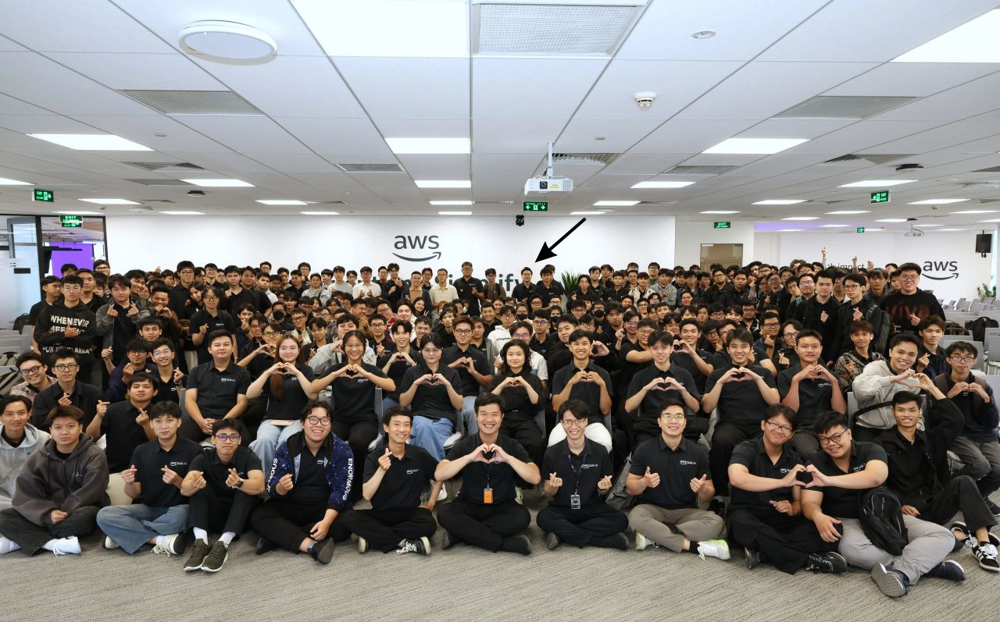

# Summary Report: “FCAJ Community Day”

### Event Objectives

- This session was organized to provide students and those new to AWS with practical insights into the process of learning cloud computing. Rather than focusing solely on theory, the speaker introduced effective learning methods involving the hands-on deployment of services, project building, and practical exercises on AWS.

- Additionally, the program introduced two learning support tools: AWS Cloud Quest and Floci. These tools enable learners to engage with AWS in a way that is intuitive, safe, and offers clearer direction—particularly for students with limited prior experience.

- Another key objective of the event was to raise awareness regarding resource and cost management when working with AWS, thereby helping learners avoid unexpected expenses during their practical activities.

### Speakers

- **Huynh Thai Linh** 
- **The Baller** 
- **Nguyen Thi Quynh Nhu** 
- **Tran Huu Nghia**
- **Tran Minh Quan**
- **Khắc Uy**

### Key highlights of the event

#### 1. Learn AWS through hands-on experience.

- One of the key takeaways from the session was that learning AWS is far more effective when learners engage in hands-on practice with the services, rather than simply reading documentation or watching tutorials.

- Deploying resources, configuring systems, and troubleshooting issues firsthand enables learners to gain a deep understanding of how AWS services function and how they interact within a complete system.

- These experiences also help cultivate the analytical mindset and problem-solving skills essential for developing applications on cloud platforms.

- I realized that this hands-on approach not only improves knowledge retention but also boosts confidence when applying AWS to real-world projects. 

#### 2. AWS Cloud Quest

- The event introduces AWS Cloud Quest, an interactive, game-based learning platform.

- Instead of relying on traditional learning methods, learners complete hands-on tasks to gradually familiarize themselves with AWS services.

- Cloud Quest features guided labs, real-world job simulations, and a badge system to track progress; this motivates learners to complete challenges while building a knowledge base along a clear learning path.

- For beginners, it serves as a valuable tool that makes getting started with AWS simpler and more structured.

#### 3. Floci – Local AWS simulation environment

- In addition to Cloud Quest, the speaker introduced Floci, an open-source tool that enables the simulation of AWS services directly on a personal computer.

- Using Floci allows learners to develop, test, and experiment with cloud applications in a local environment without the need to provision resources on actual AWS infrastructure. This minimizes cost-related risks and provides a safe space for learners to freely test ideas before deploying them to a real-world environment.

- This solution is ideal for students, as it is cost-effective while offering a safe environment for hands-on practice.

#### 4. Managing costs when using AWS

- Another key topic of the session was cost management while learning AWS. Beginners often incur unexpected costs by forgetting to delete resources or creating services that exceed their actual needs.

- The speaker emphasized that using the cloud involves more than just system deployment; it also requires monitoring resources, optimizing configurations, and cleaning up the environment after completing practical exercises.

- Tips shared included regularly checking active resources, deleting unused services, tracking costs periodically, and prioritizing the use of simulation environments when testing new features.

#### Lessons learned from the event

#### Changing your AWS study method

- After the sharing session, I realized that learning AWS requires a combination of theory and practice, rather than just focusing on reading documentation. Building systems firsthand, experimenting with services, and troubleshooting errors fosters a deeper understanding of how AWS operates in real-world scenarios.

- I also came to understand that errors encountered during implementation are not obstacles, but rather opportunities to enhance my knowledge and experience.

### Gain a better understanding of learning support tools.

- The session introduced me to AWS Cloud Quest, a learning platform that offers a clear roadmap and numerous hands-on exercises closely aligned with real-world work.

- Additionally, Floci provides a more flexible learning approach by allowing users to test AWS services on their personal computers before deploying them to the cloud environment. This is particularly beneficial for students who want to practice regularly without worrying about incurring costs. 

#### Raise awareness of cost optimization.

- An important lesson I learned is that AWS resource management needs to be addressed right from the very beginning.

- Cultivating the habits of monitoring resources, cleaning up environments after practice, and selecting the appropriate services helps minimize costs and fosters a more professional work ethic. 

#### Post-event implementation plan

- Following the session, I plan to apply the knowledge I have gained to my studies and the development of the AWS BILLO project. I will continue using AWS Cloud Quest to reinforce my foundational knowledge, enhance my practical skills by building small projects using various AWS services, and proactively investigate the root causes of any errors encountered during deployment.

- Additionally, I will leverage Floci to test ideas before deploying them to the actual AWS environment, thereby minimizing risks and better managing costs. At the same time, I will maintain the habit of monitoring resources, removing unused services, and optimizing system architecture to improve AWS usage efficiency in future projects.

### Conclude

- The session provided me with valuable practical insights into learning and applying Amazon Web Services (AWS) through real-world projects. I gained a better understanding of supporting tools like AWS Cloud Quest and Floci, while also recognizing the importance of resource management and cost optimization when utilizing AWS services.

- The knowledge and experience gained from this event will serve as a foundation for my ongoing internship, the development of the AWS BILLO project, and the enhancement of my cloud computing skills. This was a highly practical activity that helped guide and support both my learning journey and my future career development. 

#### Some event photos

